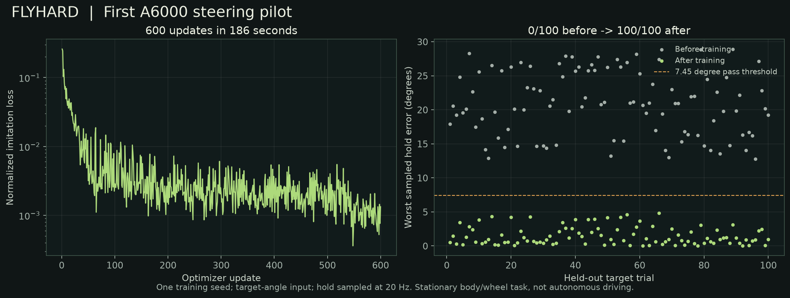

# Flyhard: first A6000 pilot

The objective is a connectome-based fly whose simulated limbs physically operate a tiny battered green Panda-style car in CARLA. This first block tested whether the data, learning computation, body mechanics, and GPU host could support that plan before committing to longer training.

**Result: learned stationary steering works in one preliminary training run.** The trained model passed all 100 held-out requested-angle trials; its untrained counterpart passed none. The complete session cost **$0.67**, leaving **$19.33** of the original $20. The Pod was terminated after verified exports, and Runpod reported no remaining Pods and zero hourly spending.

## What passed, and at what scope

| Experiment | Evidence | Interpretation |
|---|---|---|
| E00 body baseline | NeuroMechFly runs and renders locally and on the A6000; saved-state replay error is zero | Usable body/recording dependency; upstream motion targets only |
| E01 graph and gradients | 165,122 retained neurons; 25,563,197 measured neuron-pair edges; all core gradients finite/nonzero on the synthetic benchmark; held-out loss fell 99.48% | Actual selected graph is trainable without changing its topology |
| E02 wheel | 20/20 trials; disabling the explicit foot grip removes commanded wheel motion | The fly's foreleg mechanically operates a passive wheel |
| E02 pedal | 20/20 trials on both Mac and A6000; disabling contact removes commanded presses | A middle leg operates/releases a passive spring pedal; diagnostic controller only |
| E03 wheel pilot | 0/100 before training, 100/100 after; frozen interfaces and topology checked unchanged | One learned stationary skill, one training seed |
| CARLA smoke | 120/120 camera frames match synchronous world ticks, with nonblank rendering and measured vehicle displacement | CARLA graphics and control API work on this host; scripted car commands |
| E04 pilot delivery | Training/evaluation checkpoint, full scores, source manifests, clips, and export hashes saved | First bounded A6000 cycle completed |

E03 as a whole is still incomplete: three-seed replication, a conventional policy comparator, and learned pedal control remain. E05–E09 have not passed. There is no integrated body-driven CARLA run, visual driving policy, coordinated throttle/brake control, or finished Flyat car asset yet.

## The learned skill

The task input is a requested wheel angle plus measured wheel and seven joint positions. Engineered, frozen mappings inject these features into 6,365 annotated `vnc_sensory` neurons and read 708 `vnc_motor` neurons into seven foreleg joint commands. Neither mapping was optimized. Only connection-gain and neuronal-leak parameters inside the measured graph were trained.

The body is supported at the thorax. A disclosed point-grip constraint connects the left forefoot to the steering-wheel rim. Joint servos move the actual MuJoCo body; the wheel has no actuator and is never assigned its desired angle. The grip is an engineered assistance, not learned natural grasping or a detailed muscle model.

Forty training target angles generated 1,200 diagnostic demonstrations using offline inverse kinematics followed by physical joint servos. The trained policy then ran without the teacher or inverse kinematics during evaluation. The 100 withheld targets are different angles inside the training range; this demonstrates interpolation, not general driving or broad generalization.

The predeclared gate was at least 90/100 targets within 0.13 radians (7.45 degrees) during the final second of a three-second trial. Evaluation sampled the held wheel angle at 20 Hz. Results:

- Before training: **0/100**.
- After 600 optimizer updates: **100/100**.
- Mean of each trial's worst sampled hold error: **1.48 degrees**.
- Median: **0.98 degrees**; worst trial: **4.85 degrees**.
- Training time: **186.0 seconds**; complete demonstration/training/evaluation script: **684.7 seconds**.
- Peak allocated GPU memory: **3.00 GB**; trainable core parameters: **25,728,319**.
- First-batch gradient audit: 3,051,570 connection gains and 23,483 leaks had nonzero finite gradients. The full graph remained present; this task does not activate or train every neuron equally.

The matched initial model had the same fixed interfaces. Their buffers and graph topology were verified unchanged after training, making the before/after comparison evidence that changes within the core caused the improvement. It does not establish that fly topology is better than a shuffled graph or an ordinary policy.

## What the model is

The [MaleCNS v1.0 downloads](https://male-cns.janelia.org/download/) provide connectivity and annotations, not a ready-to-run driving brain. We retained `status == "Traced"` annotations and every connection between those IDs, with no extra edge-weight threshold. The result includes 124,025,046 aggregated synapses. The explicit filter differs from the published 166,691-neuron census; included and excluded IDs are preserved.

The current dynamics use signed scalar rate states, positive incoming-normalized weights with trainable bounded gains, and trainable bounded leaks. Transmitter predictions were downloaded but are not yet used to assign excitation/inhibition. Four recurrent graph updates occur per control decision, with the state reset between decisions. This is an engineered connectome model, not a reconstruction of the original fly's mental state, biological learning, or physiological timing.

The stationary skill mainly exercises ventral nerve cord pathways. Vision and the brain's sensory pathways have not been demonstrated. This distinction matters for the eventual claim that visual input drives the fly-body-car loop.

## What went wrong, and what changed

PyTorch's ordinary sparse-CSR value backward attempted a **101.57 GiB** dense intermediate and ran out of memory. Buying a bigger GPU would have hidden the wrong problem. The implementation now evaluates the exact edge-value derivative in chunks and uses sparse matrix multiplication for the state derivative. Finite-difference and dense-reference tests validate it; the full-graph synthetic benchmark then used about 3.02 GB instead. No measured edges were removed to fit memory. Only first-order gradients are implemented.

Early wheel rigs were numerically unstable. An explicit neutral-posture grip anchor, passive damping, the implicit integrator, and a 50-microsecond physics timestep produced stable physical trials. The grip intervention distinguishes foreleg-driven rotation from unrelated passive motion.

Early pedal contact was too soft, letting the foot penetrate the pad. Stiffer contact parameters fixed that; a softer preloaded return spring then reduced servo deflection enough to meet the unchanged 0.04 mm hold-error gate. Contact removal still eliminated commanded presses. Two additional timestep probes did **not** meet a separate 0.001 mm convergence target: differences were about 0.00115 and 0.00154 mm. The 20-trial operating gate passed, but micrometer-level convergence is not established. These failed probes are retained and should inform the next pedal-learning setup.

Runpod's Community A6000 request found no capacity and created no Pod. Secure Cloud was available. The persistent filesystem rejected ownership changes during transfers/unpacking; `rsync -rltz` and local-disk CARLA extraction avoided that. EGL/Vulkan libraries and a non-root Unreal process were needed for real offscreen cameras.

## Recordings and reproducibility

The learned replay contains the first two held-out trials, selected by their fixed evaluation order. Body state is recorded at 200 Hz, neural decisions at 20 Hz, and physics runs at 20 kHz. The displayed neural decision precedes the following ten body samples, with both timestamps retained. Saved-state replay has zero qpos error.

The right-hand panel projects 12,000 fixed sampled measured soma positions and colors them with recorded signed model rate states using a fixed asinh scale. It is not observed neural activity or simulated spikes. Playback is 0.3x. The CARLA clip is a separate, explicitly scripted infrastructure test and is not presented as part of the learned episode.

The project is in `~/Developer/flyhard`. Source is committed locally with MIT licensing for original code; the intended GitHub home remains `MarkUnthank/flyhard`, and public publication has not occurred. Third-party licenses and the stock-photo reference are handled separately in [THIRD_PARTY.md](../THIRD_PARTY.md). [Reproduction instructions](reproduce.md) record the tested versions and commands; a second clean-host install has not yet been verified.

All 100 before/after evaluation scores and the configuration are in `reports/2026-09-09/e03-wheel-pilot/`. Large graph/checkpoint/trace files remain in ignored `data/` and `runs/` folders. An 81-file export manifest verified **2,859,224,941 bytes** against the Pod before termination, including both checkpoints and the graph. The checkpoints include optimizer state; exact RNG-resume automation remains unimplemented.

Verification: **8 tests passed on the A6000; 7 on Mac** (the extra case exercises CUDA). The body recordings, two independent mechanical interventions, full graph benchmark, held-out physical evaluation, and synchronous CARLA camera test provide experiment-level evidence beyond those unit tests.

## Hardware decision and next block

Keep the A6000. The observed allocation was 48 GB GPU memory, 9 vCPUs and 50 GB host RAM. The Pod ran for about 72 minutes including installation, downloading, troubleshooting, rendering and exports. Its observed all-in rate was $0.558/hour. The final API balance was $19.3336233816 with zero Pods and $0/hour spending. Auto-pay was disabled, and no credit was added.

The present training allocation fits comfortably. The measured 11.4-minute wheel cycle includes substantial body simulation/evaluation time, so a GPU-only upgrade cannot be assumed to accelerate the entire workload. No integrated CARLA/neural throughput or total driving-training duration has been measured.

The next bounded block should:

1. Repeat steering with two additional training seeds and retain each score separately.
2. Refine pedal contact convergence, train pedal tracking, and add a conventional-policy diagnostic baseline.
3. Combine wheel, throttle and brake in one physical cockpit, then verify that measured positions alone produce the logged CARLA commands.
4. Teach one visual left/right turn and run camera/core/control interventions before expanding to a course.

The worn green Panda-style Flyat remains the presentation target. Its asset work should follow the combined cockpit geometry. This pilot increases confidence in trainability and physical actuation; it does not yet establish visual driving or predict whether an eventual video will go viral.
